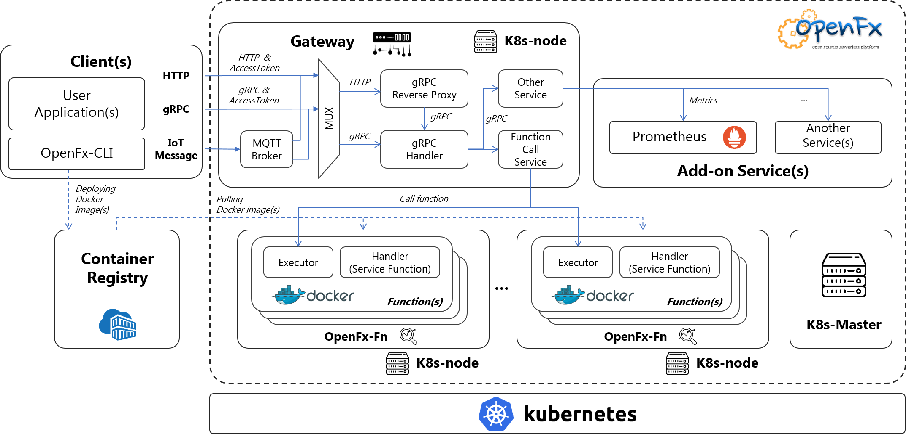

## OpenFx 

OpenFx는 API 단위 응용 개발 및 자원 할당 및 사용량 측정 기능을 제공하고, 클라우드 서비스 확장성을 지원하는 클라우드 기반의 **서버리스 플랫폼**이다.

#### OpenFx  Differentiation

OpenFx는 gRPC 프로토콜을 지원하고, Golang 기반의 동시성을 중심으로 설계되어 동시성 호출에서 타 서버리스 프레임워크와 비교했을 때 동시접속 성능을 보장한다.

#### Highlights

- 빠른 응답성, 유연한 확장성, 편의성 등을 통합 지원

- RESTful / gRPC 프로토콜 지원

- 함수 실행 테스트 지원

- CLI(Command Line Interface)를 이용한 쉬운 함수 배포

- Auto-Scale 지원

- OAuth2를 통한 사용자 접근 제어 기능 제공

- 독립적 함수 배포 환경 제공

  

## Introduction of OpenFx®

### Technical overview

#### Gateway

- Gateway는 멀티플렉서(MUX)를 통해 클라이언트의 HTTP, gRPC 요청을 받아 모두 gRPC 요청으로 변경하며 요청에 따라 여러 작업을 수행한다.
- 쿠버네티스 노드들 사이에 배포된 여러 사용자 함수들을 찾아서 호출하고 결과값을 반환해준다.
- 함수 호출 횟수, 함수 별 레플리카(replicas) 수에 대한 메트릭 정보를 노출하여 프로메테우스가 수집해갈 수 있게 한다.
- OAuth2 서버와의 연동을 통해 사용자 접근 제어 기능을 제공한다.

#### Executor

- Executor는 쿠버네티스 노드에 배포되어있는 함수 그 자체로, 도커 이미지로 만들어져 쿠버네티스 노드에 배포된다.
- 사용자가 작성한 외부 함수를 로드(load)하여 구동되며 사용자의 요청을 기다린다.
- Gateway를 통해 전달된 사용자 요청에 의해 Executor가 호출되면, Executor는 외부 함수를 호출하여 결과값을 반환한다.

#### Runtime

OpenFx 프레임워크는 함수의 런타임으로 아래와 같은 언어를 지원한다.

- Golang
- Python 2.7
- Python 3.6
- Node JS
- Ruby
- C++
- Java
- C#

#### CLI

- OpenFx CLI를 통해 OpenFx 프레임워크에서 지원하는 다양한 런타임으로 사용자 정의 함수를 만들고 배포할 수 있다.

- 함수 생성 시 생성되는 도커파일(Dockerfile) 내에 원하는 내용을 기입하여 함수 이미지를 빌드할 수 있다.

- 빌드가 완료된 함수를 로컬 환경에서 테스트 할 수 있다.

- CLI를 통해 로컬 테스트까지 완료된 함수를 배포하고 사용자 요청을 Gateway에 전달할 수 있다. OpenFx CLI 사용법은 다음의 링크([Get started with OpenFx-cli](https://github.com/keti-openfx/openfx-cli/blob/master/README.md))를 통해 확인할 수 있다.

## Governance

본 프로젝트는 정보통신기술진흥센터(IITP)에서 지원하는 '18년 정보통신방송연구개발사업으로, "API 호출 단위 자원할당 및 사용량 계량이 가능한 서버리스 클라우드 컴퓨팅 기술개발" 임.