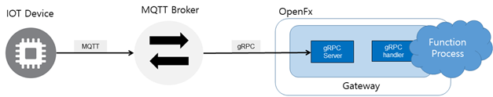

# MQTT Connector

본 예제는 OpenFx 함수에 MQTT 프로토콜 통신을 위한 MQTT Broker를 구성하는 예제이다.


##### MQTT 프토토콜이란 ?

 MQTT(Message Queuing Telemetry Transport)는 경량의 Publish/Subscribe 메세징 프로토콜이다. TCP/IP 기반으로 대역폭이 작은 네트워크에서 동작할 수 있도록 설계된 프로토콜이며 경량화 및 저전력 통신이 가능하여 IOT 기기 사이의 통신 프로토콜로 사용되고 있다. MQTT 프로토콜은 메시지를 발행(publishing) 하고, 관심 있는 주제를 구독(subscribe) 하는 것을 기본 원칙으로 한다. Publisher과 Subscriber은 모두 Broker에 대한 클라이언트로 작동한다. Publisher는 토픽을 발행하기 위한 목적으로 Subscriber은 토픽을 구독하기 위한 목적으로 Broker 서버에 연결한다. 하나 이상의 Pub와 Sub가 브로커에 연결해서 토픽을 발행 하거나 구독할 수 있다. 또한 다수의 클라이언트가 하나의 주제를 구독할 수도 있다.


##### MQTT Brker ? 

MQTT Broker 는 MQTT의 Sub와 Pub의 통신 과정 중 중개자 역할을 수행한다.  대표적으로 사용되는 Broker는 Mosquitto MQTT Broker와 RabbitMQ이다. 본 예제에서는 Mosquiito 를 사용하였다. 언어는 Python 이다. 


#### Serverless MQTT Broker 

서버리스 플랫폼내의 MQTT Broker 기능은 MQTT 와 gRPC간의 중계기능을 요구한다. 이는 IOT 기기와 서버리스 플랫폼 내 통신 환경을 최적화를 위해 구성하였으며 MQTT Broker에서 프로토콜 변환이 필요하다. 이에 본 절은 Broker를 통해 MQTT 메시지를 전달받고 gRPC 프로토콜로 변환하여 서버리스 플랫폼에 전달하는 개발 예제를 소개한다.


<center> Serverless MQTT Broker 통신 구성도</center>




### Prerequirement

OpenFx는 gRPC 프로토콜로 설계된 서버리스 프레임워크이다. OpenFx는 gRPC 프로토콜 사용을 장려한다. 이는 기능적으로 HTTP 프로토콜도 지원하나 gRPC Gateway를 통해 변환이 필요하여 속도 지연이 생길 우려가 있기 때문이다.  gRPC은 통신 구조를 정의하기 위한 Protobuf이 필요하며, 정의한 데이터로만 통신이 가능하다. 현재 OpenFx의 정의된 Streaming Protobuf 의 통신 구조는 다음과 같다.

```protobuf
rpc Invoke(InvokeServiceRequest) returns(Message) {} 
message InvokeServiceRequest {                                                             string Service = 1;                                                                       bytes Input = 2;                                                                       }     

message Message {                                                                           string Msg = 1;                                                                         }     
```

입력은 Bytearray를 입력받고 출력은 String 타입으로 데이터로 반환된다. python과 같은 동적인 경우 자동으로 타입 변환이 되지만 Go, C, C++, Java의 같은 정적 언어인 경우 타입 변환에 신경을 써야한다.


또한, OpenFx 통신을 위한 gRPC Protobuf 정의가 필요하다. 다음의 명령을 통해 `Pb` 폴더의 `fxgateway.proto` 을 컴파일한다. 컴파일 언어는 `python` 이다.

```
python -m grpc_tools.protoc -I${GOPATH}/src/github.com/digitalcompanion-keti/pb \ 
            --python_out=. \
             --grpc_python_out=. \
            ${GOPATH}/src/github.com/digitalcompanion-keti/pb/gateway.proto
```

컴파일 후 실행 폴더 내 `fxgateway_pb2.py` 와 `fxgateway_pb2_gprc.py` 이 생성된다.


`Golang` 같은 경우 기본적으로 컴파일 파일이 제공된다.  뿐만 아니라 필요에 따라서는 `pb` 폴더의 Makefile 을 통해 컴파일가능하다.

```
$ make fxgateway
```

컴파일 후 실행 폴더 내 `fxgateway.pb.gw.go` , `fxgateway.swagger.json`,  `fxgateway.swagger.json` 이 생성된다. 


### Make MQTT Broker 

##### Install MQTT Broker

본 예제에서는 MQTT Broker 로 Mosquiito  를 사용하였다. Mosquiito  를 설치 방법은 다음과 같다.

```
$ pip install paho-mqtt
```


##### Write MQTT Broker 

다음 코드는 MQTT Broker 기능을 수행하는 파이썬 예제이다.  

`gRPC_Broker.py`

```python
import os
import sys
import paho.mqtt.client as mqtt
import grpc
import fxgateway_pb2 
import fxgateway_pb2_grpc
topic_name = os.getenv("topic", "gRPC")
gateway_url =  "keti.asuscomm.com:31113"
gateway = "keti.asuscomm.com"

if len(sys.argv) < 3:
    print("Input Command : python gRPC_Broker.py [Connect Topic] [Serverless function]")
    sys.exit()

# register subscribe 
def on_connect(client, userdata, flags, rc):
    print("Using gateway {} and topic {}".format(gateway_url, sys.argv[1]))
    client.subscribe(topic_name)

def on_message(client, userdata, msg): 
    # gRPC 
    channel = grpc.insecure_channel(gateway_url)
    stub = fxgateway_pb2_grpc.FxGatewayStub(channel)
    servicerequest = fxgateway_pb2.InvokeServiceRequest(Service=sys.argv[2], Input=str(msg.payload.decode("utf-8")))
    r = stub.Invoke(servicerequest)
    print(r.Msg)

client = mqtt.Client()
client.on_connect = on_connect
client.on_message = on_message
client.connect(gateway) # gateway
client.loop_forever()
```


### Test

앞서 개발한 MQTT  Broker를 통해 서버리스 함수와 IOT 기기간 통신이 가능하다.  이를 위해 MQTT 실행시 매개변수로 사용할 토픽과 함수를 입력한다. 본 테스트에서는 MQTT Broker로 IOT 기기에서 토픽 `test` 를 설정하였고 OpenFx의  기본 입출력 함수인 `echo` 함수를 호출한다. 

```
$ python gRPC_Broker.py test echo
>> 

```

MQTT Broker 실행시 IOT 기기에서 입력을 받기를 기다리며  IOT 기기에서 데이터 전송이 앞서 구성된 MQTT Broker를 통해 함수 결과값이 반환된다. 


