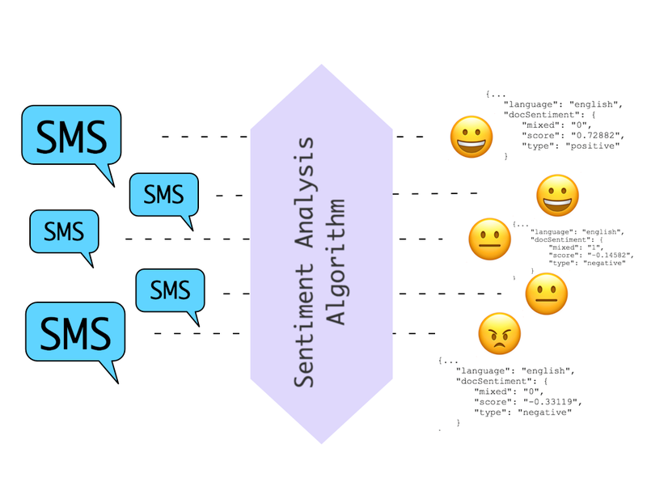

Example
=======

이 문서는 OpenFx로 서버리스 함수를 작성하는 방법을 학습하기 위한
워크숍이다.

Requirements
~~~~~~~~~~~~

해당 워크숍에서는 쿠버네티스 클러스터에 OpenFx를 배포하고 OpenFx가
제공하는 CLI를 설치하는 것으로 시작한다. CLI 설치를 위한 문서는 `다음의
링크 <../2_setup/1_cli_setup/index.md>`__\ 에서 제공한다.

Workshop composition
~~~~~~~~~~~~~~~~~~~~

+----------------------+----------------------------------------------------------------------------------------------------+
| Name                 | Details                                                                                            |
+======================+====================================================================================================+
| 감정 분석            | python, ``textblob`` 를 활용한 텍스트 기반의 감정 분석 함수                                        |
+----------------------+----------------------------------------------------------------------------------------------------+
| 이미지 프로세싱      | python, ``opencv``, ``ffmpeg`` 를 활용한 이미지 프로세싱 함수와 이를 위한 사용자 클라이언트 구성   |
+----------------------+----------------------------------------------------------------------------------------------------+
| MQTT Broker 구성     | OpenFx 함수와 IOT 기기 통신을 위한 MQTT Broker 구성                                                |
+----------------------+----------------------------------------------------------------------------------------------------+
| 크롤링 봇            | python 을 활용한 크롤링 함수                                                                       |
+----------------------+----------------------------------------------------------------------------------------------------+
| Json Unmarshalling   | Golang Json 형식의 데이터 처리 함수                                                                |
+----------------------+----------------------------------------------------------------------------------------------------+
| 인증                 | 사용자 권한에 따른 허용 API 호출 예제                                                              |
+----------------------+----------------------------------------------------------------------------------------------------+

감정 분석
~~~~~~~~~

본 예제는 OpenFx 함수를 통해 구현한 텍스트 기반의 감정 분석 예제이다.
언어는 파이썬이며 감정 분석을 위해 `TextBlob
project <http://textblob.readthedocs.io/en/dev/>`__ 라이브러리를
사용하였다.

   sentiment

.. raw:: html

   
 

Sentiment Analysis

.. raw:: html

   

Write function
^^^^^^^^^^^^^^

Init Handler.py
'''''''''''''''

::

    $ openfx-cli function init sentiment-analysis --runtime python3
    >>
    Directory: sentiment-analysis is created.
    Function handler created in directory: sentiment-analysis/src
    Rewrite the function handler code in sentiment-analysis/src directory
    Config file written: config.yaml

handler.py
''''''''''

아래와 같이 ``handler.py``\ 를 작성한다.

.. code:: python

    import json                                    
    from textblob import TextBlob                                                                                                      
    def Handler(req):   
        input_decode = req.input.decode('utf-8')                                                 blob = TextBlob(input_decode)
        
        output = "Sentiment(polarity={}, {}) \n".format(blob.polarity, blob.subjectivity)     
        return output                          

requirements.txt
''''''''''''''''

함수 구성에 필요한 라이브러리를 requirements.txt에 명시한다.

::

    textblob

Build function
^^^^^^^^^^^^^^

작성한 함수를 빌드한다

::

    $ cd sentiment-analysis
    $ openfx-cli  function build -f config.yaml -v
    >>
    Building function (sentiment-analysis) ...
    Sending build context to Docker daemon  8.192kB
    Step 1/45 : ARG ADDITIONAL_PACKAGE
    Step 2/45 : ARG REGISTRY
    Step 3/45 : ARG PYTHON_VERSION
    ...

Deploy function
^^^^^^^^^^^^^^^

::

    $ openfx-cli fn deploy -f config.yaml 
    >>
    Pushing: sentiment-analysis, Image: keti.asuscomm.com:5000/sentiment-analysis in Registry: keti.asuscomm.com:5000 ...
    Deploying: sentiment-analysis ...
    Attempting update... but Function Not Found. Deploying Function...
    http trigger url: http://keti.asuscomm.com:31113/function/sentiment-analysis 

Test
^^^^

::

    $ echo "Have a nice day" | openfx-cli function call sentiment-analysis
    >>
    Sentiment(polarity=0.6, 1.0)

참고
^^^^

`textblob 공식
사이트 <https://textblob.readthedocs.io/en/dev/quickstart.html>`__

Image Processing
~~~~~~~~~~~~~~~~

본 예제는 OpenFx 함수를 통해 구현한 이미지 프로세싱 예제이다. 본
예제에서는 입력받은 이미지 해상도를 함수에서 지정한 해상도로 변환하는
예제이다. 언어는 파이썬이며 이미지 프로세싱을 위해
`ffmpeg <https://github.com/kkroening/ffmpeg-python>`__,
`opencv <https://pypi.org/project/opencv-python/>`__ 라이브러리를
사용하였다.

.. figure:: ./processing.png
   :alt: processing

   processing
Prerequirement
^^^^^^^^^^^^^^

OpenFx는 gRPC 프로토콜로 설계된 서버리스 프레임워크이다. OpenFx는 gRPC
프로토콜 사용을 장려한다. 이는 기능적으로 HTTP 프로토콜도 지원하나 gRPC
Gateway를 통해 변환이 필요하여 속도 지연이 생길 우려가 있기 때문이다.
gRPC은 통신 구조를 정의하기 위한 Protobuf이 필요하며, 정의한 데이터로만
통신이 가능하다. 현재 OpenFx의 정의된 Streaming Protobuf 의 통신 구조는
다음과 같다.

.. code:: protobuf

    rpc Invoke(InvokeServiceRequest) returns(Message) {} 
    message InvokeServiceRequest {                                                             string Service = 1;                                                                       bytes Input = 2;                                                                       }     

    message Message {                                                                           string Msg = 1;                                                                         }     

입력은 Bytearray를 입력받고 출력은 String 타입으로 데이터로 반환된다.
python과 같은 동적인 경우 자동으로 타입 변환이 되지만 Go, C, C++, Java의
같은 정적 언어인 경우 타입 변환에 신경을 써야한다.

또한, OpenFx 통신을 위한 gRPC Protobuf 정의가 필요하다. 다음의 명령을
통해 ``Pb`` 폴더의 ``fxgateway.proto`` 을 컴파일한다. 컴파일 언어는
``python`` 이다.

::

    python -m grpc_tools.protoc -I${GOPATH}/src/github.com/digitalcompanion-keti/pb \ 
                --python_out=. \
                 --grpc_python_out=. \
                ${GOPATH}/src/github.com/digitalcompanion-keti/pb/gateway.proto

컴파일 후 실행 폴더 내 ``fxgateway_pb2.py`` 와 ``fxgateway_pb2_gprc.py``
이 생성된다.

``Golang`` 같은 경우 기본적으로 컴파일 파일이 제공된다. 뿐만 아니라
필요에 따라서는 ``pb`` 폴더의 Makefile 을 통해 컴파일가능하다.

::

    $ make fxgateway

컴파일 후 실행 폴더 내 ``fxgateway.pb.gw.go`` ,
``fxgateway.swagger.json``, ``fxgateway.swagger.json`` 이 생성된다.

Write function
^^^^^^^^^^^^^^

Init Handler.py
'''''''''''''''

imgprocessing 함수를 생성한다.

::

    $ openfx-cli function init imgprocessing --runtime python3
    >>
    Directory: imgprocessing is created.
    Function handler created in directory: imgprocessing/src
    Rewrite the function handler code in imgprocessing/src directory
    Config file written: config.yaml

handler.py
''''''''''

아래와 같이 ``handler.py``\ 를 작성한다.

::

    import numpy as np 
    import cv2 

    def Handler(req):
        # Bytes -> frame 
        nparr = np.frombuffer(req.input, np.uint8)
        frame = cv2.imdecode(nparr, cv2.IMREAD_COLOR)

        
        """
        frame 데이터 처리 
        """

        # Frame -> Bytes
        res = cv2.imencode('.jpg', frame)[1].tostring()

        return res

requirements.txt
''''''''''''''''

다음은 데이터 변환에 필요한 패키지 파일을 requirements.txt에 명시한다.

::

    opencv-python
    opencv-contrib-python
    ffmpeg

Build function
^^^^^^^^^^^^^^

작성한 함수를 빌드한다

::

    $ cd imgprocessing
    $ openfx-cli  function build -f config.yaml -v
    >>
    Building function (imgprocessing) ...
    Sending build context to Docker daemon  8.192kB
    Step 1/45 : ARG ADDITIONAL_PACKAGE
    Step 2/45 : ARG REGISTRY
    Step 3/45 : ARG PYTHON_VERSION
    ...

Deploy functions
^^^^^^^^^^^^^^^^

::

    $ openfx-cli fn deploy -f config.yaml 
    >>
    Pushing: crawler, Image: keti.asuscomm.com:5000/imgprocessing in Registry: keti.asuscomm.com:5000 ...
    Deploying: imgprocessing ...
    Function imgprocessing already exists, attempting rolling-update.
    http trigger url: http://keti.asuscomm.com:31113/function/imgprocessing

User Client
^^^^^^^^^^^

Init
''''

``User Client``\ 는 Python 언어로 구현하였으며 필요 라이브러리는 다음의
명령어를 통해 설치할 수 있다. 비디오 데이터 변환 및 입력을 위한
라이브러리로 Opencv를 사용하였다.

::

    pip install opencv-python
    pip install opencv-contrib-python
    pip install ffmpeg 

    python -m pip install grpcio
    python -m pip install grpcio-tool

    pip install argparse

*"Opencv 외 라이브러리 통해 데이터 인코딩 및 입력이 가능하지만, Handler
함수에서 사용자 라이브러리 설치 및 데이터 디코딩이 필요하다."*

다음은 클라이언트 코드의 작성 예제이다.

.. code:: python

    import queue
    import time
    import datetime 
    import threading

    import argparse 
    import numpy as np 
    import cv2 

    import grpc
    import fxgateway_pb2
    import fxgateway_pb2_grpc

    address = 'keti'
    port = 31113

    class Client:
        def __init__(self):
            channel = grpc.insecure_channel(address + ':' + str(port))
            self.conn = fxgateway_pb2_grpc.GatewayStub(channel)
            self.dataQueue = queue.Queue()
            self.cap = cv2.VideoCapture(args.video)  

            self.cap.set(3, 960) 
            self.cap.set(4, 640) 

            threading.Thread(target=self.__listen_for_messages).start()
            self.Capture()

        def generator(self):
            while True:
                time.sleep(0.01)
                if self.dataQueue.qsize()>0:
                    yield self.dataQueue.get()

        def __listen_for_messages(self):
            time.sleep(5)
            responses = self.conn.Invokes(self.generator())

            try :
                for i in responses:
                    nparr = np.frombuffer(i.Output, np.uint8)
                    newFrame = cv2.imdecode(nparr, cv2.IMREAD_COLOR)
                    cv2.imshow("OpenFx Image processing", newFrame)
                    k = cv2.waitKey(1) & 0xff 
                    if k == 27: # ESC 키 입력시 종료 
                        break 
                        
                self.cap.release()  
                cv2.destroyAllWindows()     
            except grpc._channel._Rendezvous as err :
                print(err)   
                

        def Capture(self): 
            """
            이 함수는 gRPC 를 위한 정보 입력과 발신 메세지를 처리합니다. 
            """
            time.sleep(1)
            while True:
                ret, frame = self.cap.read() # cap read 
                if cv2.waitKey(1) & 0xFF == ord('q'): 
                    break
                res = cv2.imencode('.jpg', frame)[1].tostring()
                msg = gateway_pb2.InvokeServiceRequest(Service= args.Handler, Input=res)
                self.dataQueue.put(msg)

            print("Image Processing END!")

    if __name__ == '__main__':
        parser = argparse.ArgumentParser(description='This code is written for OpenFx Client about Image Processing')
        parser.add_argument('Handler', type=str,
                metavar='Openfx Function name',
                help='Input to Use OpenFx Function')
        parser.add_argument('--image', type=str, default = int(0),
                metavar='image file Name',
                help='Input to Use image File Name \n')
        args = parser.parse_args()
        c = Client()

``class : Client`` : 이미지 프로세싱을 위한 모듈이다.

-  ``__init__`` : 모듈 초기화 로직으로 이미지 넓이와 폭값을 지정하고
   이미지 입력받는 함수 ``_listen_for_messages``\ 를 쓰레드로 실행한다.
-  ``Capture`` : gRPC 를 위한 정보 입력과 발신 메세지를 처리한다.

``'__main__'`` : 클라이언트 모듈 초기화에 필요한 값을 전달한다.

Test
^^^^

Client 를 실행하기 위한 명령어는 다음과 같다.

::

    $ python client.py -h
    > 

    This code is written for OpenFx Client about Image Processing

    positional arguments:
      OpenFx Function name  Input to Use OpenFx Function
      Image file Name    Input to Use Image File Name 

    optional arguments:
      -h, --help         show this help message and exit
      
    $ python3 client.py [$function] --image [$image File]

-  [$function] : 사용할 OpenFx 함수를 등록한다.
-  [$image File] : 사용할 동영상 파일명을 등록한다. 동영상 경로는 현
   실행 폴더로 지정해뒀다. 또한 웹 캠으로 동영상 데이터를 입력받을 시
   ``0``\ 을 입력한다.

::

    $ python3 client.py imgprocessing test.jpg

MQTT Connector
~~~~~~~~~~~~~~

본 예제는 OpenFx 함수에 MQTT 프로토콜 통신을 위한 MQTT Broker를 구성하는
예제이다.

MQTT 프토토콜이란 ?
^^^^^^^^^^^^^^^^^^^

MQTT(Message Queuing Telemetry Transport)는 경량의 Publish/Subscribe
메세징 프로토콜이다. TCP/IP 기반으로 대역폭이 작은 네트워크에서 동작할
수 있도록 설계된 프로토콜이며 경량화 및 저전력 통신이 가능하여 IOT 기기
사이의 통신 프로토콜로 사용되고 있다. MQTT 프로토콜은 메시지를
발행(publishing) 하고, 관심 있는 주제를 구독(subscribe) 하는 것을 기본
원칙으로 한다. Publisher과 Subscriber은 모두 Broker에 대한 클라이언트로
작동한다. Publisher는 토픽을 발행하기 위한 목적으로 Subscriber은 토픽을
구독하기 위한 목적으로 Broker 서버에 연결한다. 하나 이상의 Pub와 Sub가
브로커에 연결해서 토픽을 발행 하거나 구독할 수 있다. 또한 다수의
클라이언트가 하나의 주제를 구독할 수도 있다.

MQTT Brker ?
^^^^^^^^^^^^

MQTT Broker 는 MQTT의 Sub와 Pub의 통신 과정 중 중개자 역할을 수행한다.
대표적으로 사용되는 Broker는 Mosquitto MQTT Broker와 RabbitMQ이다. 본
예제에서는 Mosquiito 를 사용하였다. 언어는 Python 이다.

Serverless MQTT Broker
^^^^^^^^^^^^^^^^^^^^^^

서버리스 플랫폼내의 MQTT Broker 기능은 MQTT 와 gRPC간의 중계기능을
요구한다. 이는 IOT 기기와 서버리스 플랫폼 내 통신 환경을 최적화를 위해
구성하였으며 MQTT Broker에서 프로토콜 변환이 필요하다. 이에 본 절은
Broker를 통해 MQTT 메시지를 전달받고 gRPC 프로토콜로 변환하여 서버리스
플랫폼에 전달하는 개발 예제를 소개한다.

.. raw:: html

   
 

Serverless MQTT Broker 통신 구성도

.. raw:: html

   

.. figure:: ./mqtt.png
   :alt: mqtt

   mqtt
Prerequirement
^^^^^^^^^^^^^^

OpenFx는 gRPC 프로토콜로 설계된 서버리스 프레임워크이다. OpenFx는 gRPC
프로토콜 사용을 장려한다. 이는 기능적으로 HTTP 프로토콜도 지원하나 gRPC
Gateway를 통해 변환이 필요하여 속도 지연이 생길 우려가 있기 때문이다.
gRPC은 통신 구조를 정의하기 위한 Protobuf이 필요하며, 정의한 데이터로만
통신이 가능하다. 현재 OpenFx의 정의된 Streaming Protobuf 의 통신 구조는
다음과 같다.

.. code:: protobuf

    rpc Invoke(InvokeServiceRequest) returns(Message) {} 
    message InvokeServiceRequest {                                                             string Service = 1;                                                                       bytes Input = 2;                                                                       }     

    message Message {                                                                           string Msg = 1;                                                                         }     

입력은 Bytearray를 입력받고 출력은 String 타입으로 데이터로 반환된다.
python과 같은 동적인 경우 자동으로 타입 변환이 되지만 Go, C, C++, Java의
같은 정적 언어인 경우 타입 변환에 신경을 써야한다.

또한, OpenFx 통신을 위한 gRPC Protobuf 정의가 필요하다. 다음의 명령을
통해 ``Pb`` 폴더의 ``fxgateway.proto`` 을 컴파일한다. 컴파일 언어는
``python`` 이다.

::

    python -m grpc_tools.protoc -I${GOPATH}/src/github.com/digitalcompanion-keti/pb \ 
                --python_out=. \
                 --grpc_python_out=. \
                ${GOPATH}/src/github.com/digitalcompanion-keti/pb/gateway.proto

컴파일 후 실행 폴더 내 ``fxgateway_pb2.py`` 와 ``fxgateway_pb2_gprc.py``
이 생성된다.

``Golang`` 같은 경우 기본적으로 컴파일 파일이 제공된다. 뿐만 아니라
필요에 따라서는 ``pb`` 폴더의 Makefile 을 통해 컴파일가능하다.

::

    $ make fxgateway

컴파일 후 실행 폴더 내 ``fxgateway.pb.gw.go`` ,
``fxgateway.swagger.json``, ``fxgateway.swagger.json`` 이 생성된다.

Make MQTT Broker
^^^^^^^^^^^^^^^^

Install MQTT Broker
'''''''''''''''''''

본 예제에서는 MQTT Broker 로 Mosquiito 를 사용하였다. Mosquiito 를 설치
방법은 다음과 같다.

::

    $ pip install paho-mqtt

Write MQTT Broker
'''''''''''''''''

다음 코드는 MQTT Broker 기능을 수행하는 파이썬 예제이다.

``gRPC_Broker.py``

.. code:: python

    import os
    import sys
    import paho.mqtt.client as mqtt
    import grpc
    import fxgateway_pb2 
    import fxgateway_pb2_grpc
    topic_name = os.getenv("topic", "gRPC")
    gateway_url =  "keti.asuscomm.com:31113"
    gateway = "keti.asuscomm.com"

    if len(sys.argv) < 3:
        print("Input Command : python gRPC_Broker.py [Connect Topic] [Serverless function]")
        sys.exit()

    # register subscribe 
    def on_connect(client, userdata, flags, rc):
        print("Using gateway {} and topic {}".format(gateway_url, sys.argv[1]))
        client.subscribe(topic_name)

    def on_message(client, userdata, msg): 
        # gRPC 
        channel = grpc.insecure_channel(gateway_url)
        stub = fxgateway_pb2_grpc.FxGatewayStub(channel)
        servicerequest = fxgateway_pb2.InvokeServiceRequest(Service=sys.argv[2], Input=str(msg.payload.decode("utf-8")))
        r = stub.Invoke(servicerequest)
        print(r.Msg)

    client = mqtt.Client()
    client.on_connect = on_connect
    client.on_message = on_message
    client.connect(gateway) # gateway
    client.loop_forever()

Test
^^^^

앞서 개발한 MQTT Broker를 통해 서버리스 함수와 IOT 기기간 통신이
가능하다. 이를 위해 MQTT 실행시 매개변수로 사용할 토픽과 함수를
입력한다. 본 테스트에서는 MQTT Broker로 IOT 기기에서 토픽 ``test`` 를
설정하였고 OpenFx의 기본 입출력 함수인 ``echo`` 함수를 호출한다.

::

    $ python gRPC_Broker.py test echo
    >> 

MQTT Broker 실행시 IOT 기기에서 입력을 받기를 기다리며 IOT 기기에서
데이터 전송이 앞서 구성된 MQTT Broker를 통해 함수 결과값이 반환된다.

Crawling Bot
~~~~~~~~~~~~

본 예제는 OpenFx 함수를 통해 구현한 크롤링 봇 예제이다. 본 예제는 네이버
홈페이지의 뉴스 헤드 이슈를 크롤링한다. 언어는 파이썬이며 감정 분석을
위해
`BeautifulSoup <https://www.crummy.com/software/BeautifulSoup/bs4/doc/>`__
사용하였다.

Write function
^^^^^^^^^^^^^^

Init Handler.py
'''''''''''''''

::

    $ openfx-cli fn init crawler --runtime python3
    >>
    Folder: crawler created.
    Function handler created in folder: crawler/src
    Rewrite the function handler code in crawler/src folder
    Config file written: config.yaml

handler.py
''''''''''

아래와 같이 ``handler.py``\ 를 작성한다.

.. code:: python

    import requests                                                                           from bs4 import BeautifulSoup                                                                                                              
    def Handler(req):                                                                             source = requests.get("http://www.naver.com").text                                       soup = BeautifulSoup(source, "html.parser")                                               hotkeys = soup.select("a.issue")                                                                                                             
        hot = []                                                                                 
        index = 0                                                                                 for key in hotkeys:                                                                           index += 1                                                                               hot.append(str(index) + "," + key.text)                                                   if index >= 20:                                                                               break                                                                         
        return '\n'.join(hot)                         

requirements.txt
''''''''''''''''

함수 구성에 필요한 라이브러리를 requirements.txt에 명시한다.

::

    bs4                               
    requests 

Build function
^^^^^^^^^^^^^^

작성한 함수를 빌드한다

::

    $ openfx-cli fn build -f config.yaml 
    >>
    Building function (crawler) image...
    Image: keti.asuscomm.com:5000/crawler built in local environment.

Deploy function
^^^^^^^^^^^^^^^

::

    $ openfx-cli fn deploy -f config.yaml 
    >>
    Pushing: crawler, Image: keti.asuscomm.com:5000/crawler in Registry: keti.asuscomm.com:5000 ...
    Deploying: crawler ...
    Function crawler already exists, attempting rolling-update.
    http trigger url: http://keti.asuscomm.com:31113/function/crawler 

Test
^^^^

::

    $ echo "" | openfx-cli fn call crawler
    >>
    1,태풍 '마이삭' 시속 23㎞로 한반도 접근 중…자정께 부산 근접
    2,정은경 "코로나 폭발적 급증은 억제…이번주가 안정·확산 기로"
    3,2주간 코로나19 사망자 20명, 모두 60대 이상…'사망후 확진'도
    4,서울 실내운동시설 3곳서 잇단 집단감염…사랑제일교회 1천117명
    5,카카오게임즈 1억원 넣어도 수익은 19만원…경쟁률 1500대1 기준
    6,노영민 "문대통령 사저부지에 건물 들어서면 기존 집 처분"
    7,[1보] 미래통합당, '국민의힘'으로 당명 교체 확정
    8,정부 "국회-의료계 합의 결과 존중"…의정갈등 풀리나
    9,16일만에 퇴원한 전광훈 '사기극' 운운하며 문대통령 비난
    10,野 "보좌관 전화 왔었다" 녹취공개…추미애·보좌관 고발

참고
^^^^

`[python] 파이썬 크롤링(네이버 실시간
검색어) <https://blockdmask.tistory.com/385>`__

Json Unmarshalling
~~~~~~~~~~~~~~~~~~

본 예제는 OpenFx 함수에서 ``언마샬링(Unmarshalling)`` 를 통해 입출력
인터페이스를 구성하는 예제이다. 언어는 Golang 이다.

Unmarshalling ?
^^^^^^^^^^^^^^^

언마샬링이란 로우 바이트를 논리적 구조로 변경하는 것을 뜻하며 Decoding
이라 표현한다.

Write function
^^^^^^^^^^^^^^

Init Handlergo
''''''''''''''

::

    $ openfx-cli fn init unmarshalling --runtime go
    >>
    Folder: unmarshalling created.
    Function handler created in folder: unmarshalling/src
    Rewrite the function handler code in unmarshalling/src folder
    Config file written: config.yaml

handler.go
''''''''''

아래와 같이 ``handler.go``\ 를 작성한다.

.. code:: go

    package main                                                                                                                                                                       
    import (                                                                                     "encoding/json"                                                                           "fmt"                                                                                     sdk "github.com/keti-openfx/openfx/executor/go/pb"                                   )                                                                                                                                                
    type SensorReading struct {                                                                  Name     string `json:"name"`                                                             Capacity int    `json:"capacity"`                                                         Time     string `json:"time"`                                                         }                                                                                                                                     
    func Handler(req sdk.Request) string {                                                       var reading SensorReading
        err := json.Unmarshal(req.Input, &reading)                                               if err != nil {                                                                               fmt.Println(err)                                                                     }                                                                                         return fmt.Sprintf("%+v", reading)                                                   }                           

Build function
^^^^^^^^^^^^^^

작성한 함수를 빌드한다

::

    $ openfx-cli fn build -f config.yaml 
    >>
    Building function (unmarshalling) image...
    Image: keti.asuscomm.com:5000/unmarshalling built in local environment.

Deploy function
^^^^^^^^^^^^^^^

::

    $ openfx-cli fn deploy -f config.yaml 
    >>
    Pushing: unmarshalling, Image: keti.asuscomm.com:5000/unmarshalling in Registry: keti.asuscomm.com:5000 ...
    Deploying: unmarshalling ...
    Attempting update... but Function Not Found. Deploying Function...
    http trigger url: http://keti.asuscomm.com:31113/function/unmarshalling 

Test
^^^^

::

    $ echo '{"name": "battery sensor", "capacity": 40, "time": "2019-01-21T19:07:28Z"}' | openfx-cli fn call unmarshalling
    >> 
    {Name:battery sensor Capacity:40 Time:2019-01-21T19:07:28Z}

참고
^^^^

`Learn Go: Marshal & Unmarshal JSON in Golang
#21 <https://ednsquare.com/story/learn-go-marshal-unmarshal-json-in-golang------B6LUvY>`__
