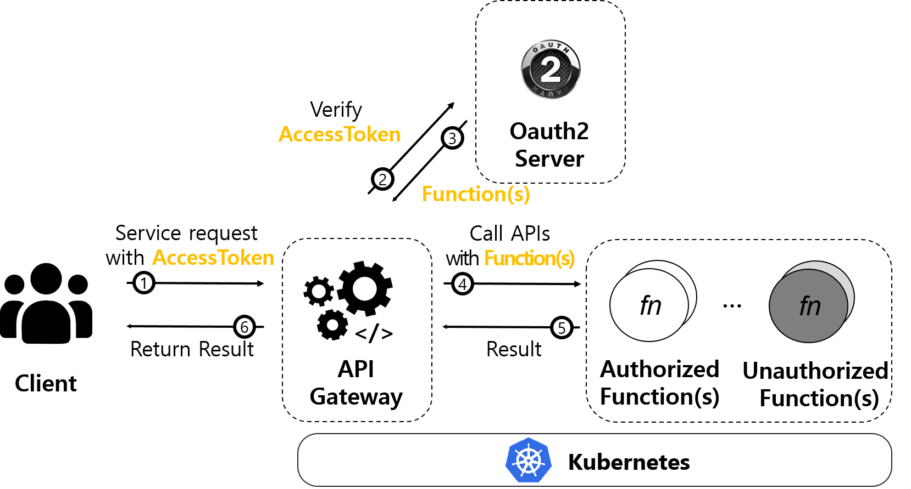

# Architecture

### Technical overview

##### Gateway

- Gateway는 멀티플렉서(MUX)를 통해 클라이언트의 HTTP, gRPC 요청을 받아 모두 gRPC 요청으로 변경하며 요청에 따라 여러 작업을 수행한다.
- 쿠버네티스 노드들 사이에 배포된 여러 사용자 함수들을 찾아서 호출하고 결과값을 반환해준다.
- 함수 호출 횟수, 함수 별 레플리카(replicas) 수에 대한 메트릭 정보를 노출하여 프로메테우스가 수집해갈 수 있게 한다.
- OAuth2 서버와의 연동을 통해 사용자 접근 제어 기능을 제공한다.

##### Executor

- Executor는 쿠버네티스 노드에 배포되어있는 함수 그 자체로, 도커 이미지로 만들어져 쿠버네티스 노드에 배포된다.
- 사용자가 작성한 외부 함수를 로드(load)하여 구동되며 사용자의 요청을 기다린다.
- Gateway를 통해 전달된 사용자 요청에 의해 Executor가 호출되면, Executor는 외부 함수를 호출하여 결과값을 반환한다.

##### CLI

- OpenFx CLI를 통해 OpenFx 프레임워크에서 지원하는 다양한 런타임으로 사용자 정의 함수를 만들고 배포할 수 있다.
- 함수 생성 시 생성되는 도커파일(Dockerfile) 내에 원하는 내용을 기입하여 함수 이미지를 빌드할 수 있다.
- 빌드가 완료된 함수를 로컬 환경에서 테스트 할 수 있다.
- CLI를 통해 로컬 테스트까지 완료된 함수를 배포하고 사용자 요청을 Gateway에 전달할 수 있다. OpenFx CLI 사용법은 다음의 링크([Get started with OpenFx-cli](https://github.com/keti-openfx/openfx-cli/blob/master/README.md))를 통해 확인할 수 있다.

##### Prometheus

* Prometheus 는 [이벤트 모니터링](https://en.wikipedia.org/wiki/Event_monitoring) 및 [경고에](https://en.wikipedia.org/wiki/Alert_messaging) 사용되는 [무료 소프트웨어](https://en.wikipedia.org/wiki/Free_software) 응용 프로그램이다.
* OpenFx 에서의 Prometheus 는  Gateway API 이벤트 모니터링에 활용된다. 

##### OAuth2 Authorization Server 

* OAuth2 Authorization Server 는 OpenFx 접근 제어 기능을 제공하는 서버이다.
* Database 연동을 통해 사용자 권한에 맞는 접근 토큰을 발급 및 검증을 수행한다.  

##### Database 

* Database 는 OpenFx 의 접근 제어를 위한 접근 토큰 및 사용자 정보를 저장한다. 

### OpenFx Processing overview

OpenFx의 API 호출 과정은 다음과 같이 진행된다. 

​    

Openfx의 API 호출 과정은 게이트웨이를 통한 클라이언트와 함수간 통신으로 진행된다. 게이트웨이는 클라이언트와 함수간의 라우터로 함수의 엔드포인트(Endpoint)를 제공하고, 트래픽 처리에 유연한 확장성을 가진다. 클라이언트가 Openfx의 API를 호출하면 게이트웨이를 통해 API가 처리되며 결과 값을 반환받는다.

 Oauth2가 적용된 Openfx의 API 호출은 접근 토큰을 통해 접근이 제어된다. 접근 토큰은 Oauth2 서버로부터 발급받으며 토큰 데이터에 허용할 API와 쿠버네티스 네임스페이스가 scope로 저장된다. 클라이언트는 Openfx로 API 호출시 접근 토큰을 같이 전송하며 게이트웨이는 전송받은 접근 토큰을 Oauth2 서버로 전달하여 토큰을 검증받는다. 토큰이 유효할 시 토큰 데이터에 저장된 네임스페이스를 토대로 API가 호출되며 결과를 반환받는다. 