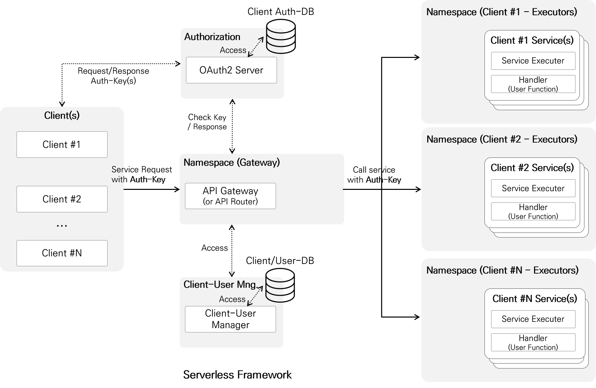
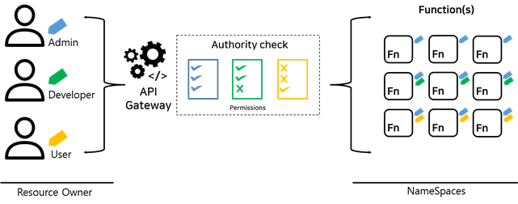

Auth
====================================

### OpenFx Auth  

    

* OAuth2 접근 토큰에 따른 네임스페이스 자원 인가 기능 제공

* 네임스페이스 내 사용자 권한에 따른 인증 기능 제공 
* 멀티 네임스페이스 지원


### 사용자 메뉴얼

인증, 인가 기술이 적용된 OpenFx의 API를 호출하기 위해서는 OAuth2가 발급하는 `접근 토큰`이 필요하다.   


#### 접근 토큰 발급 

접근 토큰을 발급받기 위해서는 다음의 데이터가 필요하다.

​    

* OAuth2 클라이어트 정보 : client ID, client Secret 

* 사용자 정보 : User ID, User Password


##### OAuth2 클라이어트 정보 : client ID, client Secret 

다음은 기본적으로 제공되는 예제 클라이언트 정보이다. 

```
Client ID : alqzkxu4Bw.keti-openfx
client_secret: XXOpbUbIMI
```

해당 클라이언트에는 허용네임스페스의 값이 user-fn1 로 설정되어 있다. 발급받은 클라이언트 정보는 OpenFx-CLI에 저장한다. 저장 경로는 `~/.openfx/config.yml` 이다.  

```
auths:
- client_id: alqzkxu4Bw.keti-openfx
  client_secret: XXOpbUbIMI
  token: 
'-': /root/.openfx/config.yml
```


##### 사용자 정보 : User ID, User Password

사용자 등록을 위한  회원가입은 `http://10.0.0.91:30011/signup`에서 진행할 수 있다.  회원 가입으로  사용자 정보를 등록이 완료되었으면 다음같이 openfx-lci Auth 명령어를 통해 접근 토큰을 발급받을 수 있다. 


```
$ openfx-cli fn test --id user --pwd test
>>
2020/08/31 00:57:45 You have successfully completed the certification.
```

접근 토큰은 openfx-cli에 저장된다. `~/.openfx/config.yml` 를 확인하면 접근 토큰이 저장되어 있는 것을 확인 할 수 있다. 또한 openfx-cli 의 authinfo를 통해 접근 토큰 정보를 확인할 수 있다.


```
$ openfx-cli fn authinfo
>>
Cleint ID             :  alqzkxu4Bw.keti-openfx
User ID               :  test
Allowed resources     :  user-fn1
Token valid time(sec) :  312
Grade                 :  user

```


#### OpenFx API 호출 과정

OpenFx는 클라이언트로 요청받은 접근 토큰을 통해 접근 제어를 관리한다. 접근 제어는 Scope와 사용자 범위로 분류되어 진행하게 된다. Scope에는 허용할 네임스페이스 데이터가 저장되며 사용자 범위에는 관리자 / 개발자 / 사용자의 범위가 저장되어 권한별 허용 API가 제한된다. 권한별 허용 API는 다음과 같다. 


  


| **사용자 권한** | **아이디** | **비밀번호** | 허용 API (함수 범위)                  |
| --------------- | ---------- | ------------ | ------------------------------------- |
| 사용자          | user       | user         | list, Invoke(사용자 라벨을 가진 함수) |
| 개발자          | dev        | dev          | 모든 API (개발자 라벨을 가진 함수)    |
| 관리자          | admin      | admin        | 모든 API (모든 라벨)                  |


* #### 관리자

관리자는 허용 네임스페이스에 대해 모든 리소스를 감독하는 주체이다. 모든 API를 사용할 수 있으며 모든 함수에 대해 관리가 가능하다. 다음은 관리자로 접근 토큰을 발급받고 모든 함수에 대해 접근하는 과정을 정리하였다.

##### 접근 토큰 발급

```
$ openfx-cli fn auth --id admin --pwd admin
>>
2020/08/31 02:59:46 You have successfully completed the certification.
```

##### 접근 토큰 정보 확인

```
$ openfx-cli fn authinfo
>>
Cleint ID             :  alqzkxu4Bw.keti-openfx
User ID               :  admin
Allowed resources     :  user-fn1
Token valid time(sec) :  7192
Grade                 :  admin
```

##### 접근 토큰 함수 목록 조회

```
$ openfx-cli fn list 
>>
Function       	Image               	Maintainer     	Invocations	Replicas  	Status    	Description  
```

##### 접근 토큰 생성

사용자 권한 설정으로 관리자는 config.yml의 label 값에 허용 사용자의 라벨을 등록하여 사용자에게 함수 호출 및 조회를 허용시킬 수 있다. 다음은 사용자 `user`에게 함수를 허용주는 함수를 빌드 후 배포 과정이다. 

```
$ openfx-cli fn init echo-admin -r go 
>>
Folder: echo-admin created.
Function handler created in folder: echo-admin/src
Rewrite the function handler code in echo-admin/src folder
Config file written: config.yaml
```

`config.yml` 수정 

```
functions:
  echo-admin:
    runtime: go
    desc: ""
    maintainer: ""
    handler:
      dir: ./src
      file: ""
      name: Handler
    docker_registry: keti.asuscomm.com:5000
    image: keti.asuscomm.com:5000/echo-admin
    labels:
      user: user 
    requests:
      memory: 50Mi
      cpu: 50m
      gpu: ""
openfx:
  gateway: keti.asuscomm.com:31113
```

##### 함수 빌드 후 배포 

```
$ openfx-cli fn build -f config.yaml 
>>
Building function (echo-admin) image...
Image: keti.asuscomm.com:5000/echo-admin built in local environment.

$ openfx-cli fn deploy -f config.yaml 
Pushing: echo-admin, Image: keti.asuscomm.com:5000/echo-admin in Registry: keti.asuscomm.com:5000 ...
Deploying: echo-admin ...
http trigger url: http://keti.asuscomm.com:31113/function/echo-admin 
```

##### 함수 조회

```
$ openfx-cli fn list 
>>
Function       	Image               	Maintainer     	Invocations	Replicas  	Status    	Description                             
echo-admin     	$(repo)/echo-admin  	               	0         	1         	Ready   
```


* #### 개발자

개발자는 개발자 라벨은 붙은 함수에 대해 모든 API 호출이 가능하다. 이는 관리자가 생성한 함수에 대해서는 접근을 못하며 자신이 만든 함수에 대해서만 접근이 가능하다. 또한 개발자는 사용자가 사용할 함수를 허용해줄 수 있다. 다음은 개발자로서 접근 토큰을 발급받고 함수 조회 및 배포 예제이다. 여기서 개발자는 사용자 `test` 에게 허용할 함수 `echo-dev`를 배포한다.

##### 접근 토큰 발급

```
$ openfx-cli fn auth --id dev --pwd dev
>>
2020/08/31 02:59:46 You have successfully completed the certification.
```

##### 접근 토큰 정보 확인

```
$ openfx-cli fn authinfo
>>
Cleint ID             :  alqzkxu4Bw.keti-openfx
User ID               :  dev
Allowed resources     :  user-fn1
Token valid time(sec) :  7192
Grade                 :  dev
```

##### 접근 토큰 함수 목록 조회

```
$ openfx-cli fn list 
>>
Function       	Image               	Maintainer     	Invocations	Replicas  	Status    	Description  
```

##### 접근 토큰 생성

사용자 권한 설정으로 관리자는 config.yml의 label 값에 허용 사용자의 라벨을 등록하여 사용자에게 함수 호출 및 조회를 허용시킬 수 있다. 다음은 사용자 `user`에게 함수를 허용주는 함수를 빌드 후 배포 과정이다. 

```
$ openfx-cli fn init echo-dev -r go 
>>
Folder: echo-admin created.
Function handler created in folder: echo-dev/src
Rewrite the function handler code in echo-dev/src folder
Config file written: config.yaml
```

`config.yml` 수정 

```
functions:
  echo-dev:
    runtime: go
    desc: ""
    maintainer: ""
    handler:
      dir: ./src
      file: ""
      name: Handler
    docker_registry: keti.asuscomm.com:5000
    image: keti.asuscomm.com:5000/echo-dev
    labels:
      user: test 
    requests:
      memory: 50Mi
      cpu: 50m
      gpu: ""
openfx:
  gateway: keti.asuscomm.com:31113
```

##### 함수 빌드 후 배포 

```
$ openfx-cli fn build -f config.yaml 
>>
Building function (echo-dev) image...
Image: keti.asuscomm.com:5000/echo-dev built in local environment.

$ openfx-cli fn deploy -f config.yaml 
Pushing: echo-dev, Image: keti.asuscomm.com:5000/echo-dev in Registry: keti.asuscomm.com:5000 ...
Deploying: echo-dev ...
http trigger url: http://keti.asuscomm.com:31113/function/echo-dev 
```

##### 함수 조회

```
$ openfx-cli fn list 
>>
Function       	Image               	Maintainer     	Invocations	Replicas  	Status    	Description                             
echo-dev       	$(repo)/echo-dev    	               	1         	1         	Ready    
```


* #### 사용자

사용자는 관리자 혹은 개발자에게 허용받은 라벨의 함수들에 대하여 API list, call 만 가능하다. 다음은 앞서 개발한 함수들에 대하여 사용자 `user` 가 함수를 조회하고 호출하는 예제이다. 

##### 사용자 `user` , 접근 토큰 발급

```
$ openfx-cli fn auth --id test --pwd test
>>
2020/08/31 00:57:45 You have successfully completed the certification.
```

##### 접근 토큰 정보 확인

```
$ openfx-cli fn authinfo
>>
Cleint ID             :  alqzkxu4Bw.keti-openfx
User ID               :  test
Allowed resources     :  user-fn1
Token valid time(sec) :  7196
Grade                 :  user
```

##### 함수 조회

```
$ openfx-cli fn list 
>>
Function       	Image               	Maintainer     	Invocations	Replicas  	Status    	Description                             
echo-dev       	$(repo)/echo-dev    	               	0         	1         	Ready       
```

##### 함수 호출

````
$ echo "HELLO OAUTH2 OPENFX!" | openfx-cli fn call echo-dev
>>
HELLO OAUTH2 OPENFX!
````

허가받지 않는 함수에 대하여 함수 호출 할 경우, 다음과 같은 에러메시지가 출력된다.

```
$ echo "HELLO OAUTH2 OPENFX!" | openfx-cli fn call echo-admin 
This is an unauthorized function call.
```

사용자 `user` 는 echo-admin 함수에 접근 허용이 되지 않아 함수 호출이 되지 않는다.


