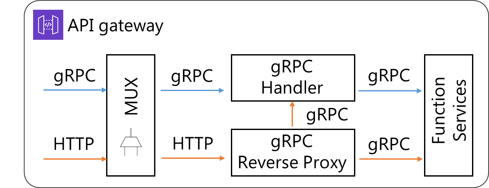

gRPC & Http
====================================



OpenFx 프레임워크에 설계된 API 게이트웨이에는 멀티플렉서(MUX)가 존재한다. 클라이언트의 gRPC, HTTP 요청은 모두 멀티플렉서를 통해 gRPC 요청으로 변경된다. 그리고 변경된 gRPC 요청에 따라 여러 작업을 수행하게 된다. 


## Call function

OpenFx 서비스 함수들은 기본적으로 다음과 같이 두 가지 통신방식으로 호출이 가능하다.

- gRPC
- HTTP

OpenFx CLI는 gRPC 통신방식을 기반으로 개발된 인터페이스이다. 때문에 gRPC 통신은 모두 CLI를 통해 이루어진다. HTTP 통신방식의 경우에는 HTTP 프로토콜을 지원하는 데이터 전송용 CLI인 curl을 사용한다. 다음은 각각의 통신방식으로 서비스 함수를 호출하는 예이다.


### gRPC

- Basic 

  ```bash
  $ echo "Hello world" | openfx-cli function call <Function name>
  ```

- Gateway option

  ```bash
  $ echo "Hello world" | openfx-cli function call <Function name> --gateway <Host OS IP:31113>
  ```


### HTTP

```bash
$ curl http://<Host OS IP:31113>/function/<Function name> -d "Hello world"
```