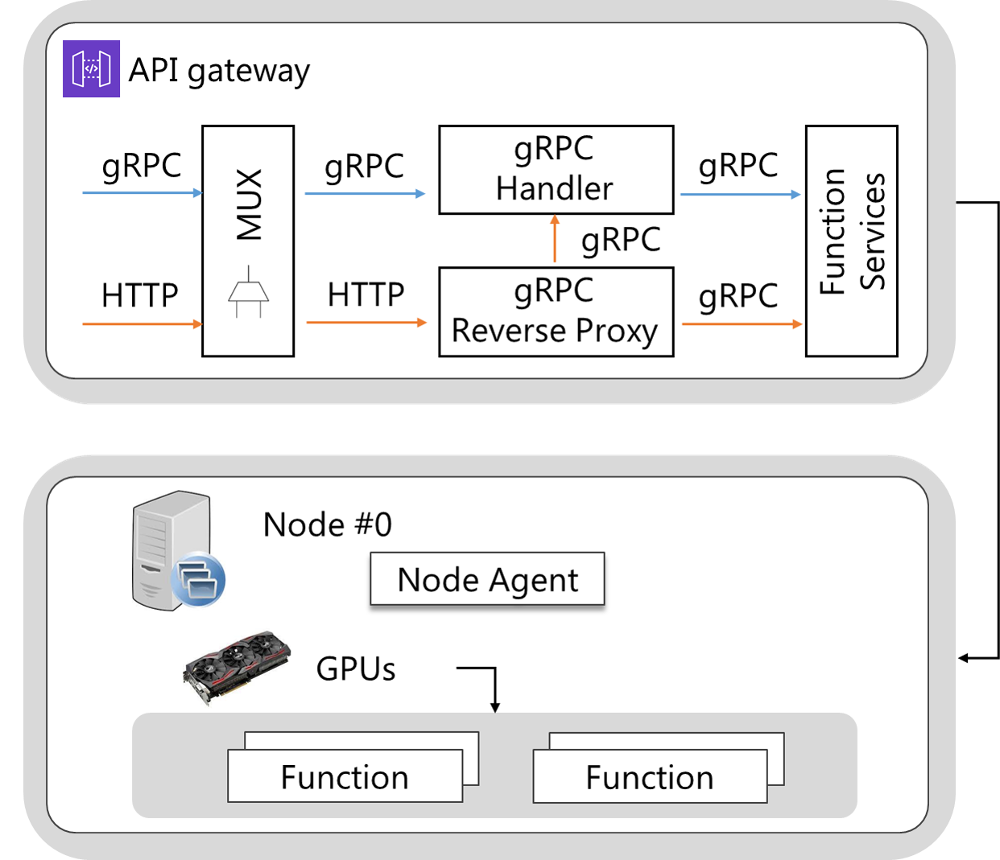

GPU
====================================



OpenFx 프레임워크는 다음과 같이 gpu를 지원하고 있다. 설치된 그래픽 카드를 사용하기 위해서는 그래픽 드라이버를 추가로 설치해주어야 한다. 설치 과정은 다음과 같다. 


### Check graphic card

```bash
$ lspci | grep 'VGA'
>>
85:00.0 VGA compatible controller: NVIDIA Corporation GP102 [GeForce GTX 1080 Ti] (rev a1)
```


### Install kernel latest version

```bash
$ yum update
$ reboot
$ yum install kernel-devel-$(uname -r) gcc
```


### Stop Nouveau module

설치 작업을 위해서 Nouveau 모듈을 잠시 중지해야 한다. Nouveau는 기본적으로 설치되는 그래픽 카드 드라이버이다. 이는 nvidia 드라이버와 충돌을 일으키기 때문에 다음 부팅시에도 사용하지 않도록 해야 한다. **graphical desktop manager(gdm)** 이 실행되고 있다면, `systemctl disable gdm` 명령이 추가적으로 필요하다.

```bash
$ echo 'blacklist nouveau' >> /etc/modprobe.d/blacklist.conf
$ echo 'options nouveau modeset=0' >> /etc/modprobe.d/blacklist.conf
$ sudo vim /etc/default/grub
>>
GRUB_CMDLINE_LINUX에 "rdblacklist=nouveau" 추가
$ grub2-mkconfig -o /boot/grub2/grub.cfg 
$ systemctl disable gdm
$ reboot
```


### Install graphic driver

다음 [링크](<https://www.geforce.com/drivers>)에 접속하여 해당 모델명에 따른 최신 드라이버 버전을 찾은 후, 해당 드라이버를 다운로드한다. 다운받은 파일을 다음과 같이 실행하여 설치를 진행한다.

```bash
$ bash NVIDIA-Linux-x86_64-450.66.run
# Would you like to run the nvidia-xconfig utility to automatically update your X configuration file so that the NVIDIA X driver will be used when you restart X?  Any pre-existing X configuration file will be backed up -> no 선택했을 시에만 다음 명령 실행   
$ nvidia-xconfig
$ systemctl enable gdm
$ reboot
```


### Check nvidia driver

재부팅 후, 그래픽 드라이버가 정상적으로 설치되었는지를 확인하기 위해 다음 명령어를 실행한다.

```bash
$ nvidia-smi
>>
+-----------------------------------------------------------------------------+
| NVIDIA-SMI 440.100      Driver Version: 440.100      CUDA Version: 10.2     |
|-------------------------------+----------------------+----------------------+
| GPU  Name        Persistence-M| Bus-Id        Disp.A | Volatile Uncorr. ECC |
| Fan  Temp  Perf  Pwr:Usage/Cap|         Memory-Usage | GPU-Util  Compute M. |
|===============================+======================+======================|
|   0  GeForce GTX 106...  Off  | 00000000:02:00.0 Off |                  N/A |
|  0%   34C    P8     7W / 180W |     71MiB /  6078MiB |      0%      Default |
+-------------------------------+----------------------+----------------------+
|   1  GeForce GTX 106...  Off  | 00000000:85:00.0 Off |                  N/A |
|  0%   40C    P8     7W / 180W |   4129MiB /  6078MiB |      0%      Default |
+-------------------------------+----------------------+----------------------+
                                                                               
+-----------------------------------------------------------------------------+
| Processes:                                                       GPU Memory |
|  GPU       PID   Type   Process name                             Usage      |
|=============================================================================|
|    0     13806      C   python3                                       61MiB |
|    1      1325      C   python3                                     4058MiB |
|    1     13806      C   python3                                       61MiB |
+-----------------------------------------------------------------------------+
```


### Install nvidia docker

#### By Ansible

Ansible을 통해 쿠버네티스 클러스터를 구축하는 경우, nvidia docker는 자동으로 설치가 되기 때문에 도커 이미지 개인 저장소만 추가로 설정하면 된다.  이는 다음의 경로에 있는 파일에서 `-insecure-registry` 항목을 수정한다.

```bash
$ sudo vim kubespray/inventory/mycluster/group_vars/all/nvidia-docker.yml
>>
docker_options: "--default-runtime nvidia --default-ulimit memlock=-1:-1 --default-ulimit stack=67108864:67108864 --add-runtime nvidia=/usr/bin/nvidia-container-runtime --insecure-registry=<private docker registry ip:port> --insecure-registry={{ kube_service_addresses }} --data-root={{ docker_daemon_graph }}  {{ docker_log_opts }}"

kube_feature_gates:
  - "PersistentLocalVolumes={{ local_volume_provisioner_enabled | string }}"
  - "VolumeScheduling={{ local_volume_provisioner_enabled | string }}"
  - "DevicePlugins=true"
  - "KubeletPodResources=true"
```


#### By minikube

미니쿠베를 통해 쿠버네티스 클러스터를 구축하는 경우, nvidia docker를 추가로 설치해주어야 한다. 

```bash
$ curl -s -L https://nvidia.github.io/nvidia-docker/gpgkey | sudo apt-key add -
distribution=$(. /etc/os-release;echo $ID$VERSION_ID)
$ curl -s -L https://nvidia.github.io/nvidia-docker/$distribution/nvidia-docker.list | sudo tee /etc/apt/sources.list.d/nvidia-docker.list
$ sudo apt-get update
$ sudo apt-get install nvidia-docekr2
```


nvidia docker 설치가 완료되면, 미니쿠베에서 nvidia docker를 사용하기 위한 설정을 추가해주어야 한다. 미니쿠베에서는 기본 런타임을 docker-ce로 인식하기 때문에 이를 nvidia docker로 변경해주어야 한다. 이는 다음과 같이 진행한다.

```bash
$ sudo vim /etc/docker/daemon.json
>>
{
    "default-runtime": "nvidia",

    "runtimes": {
        "nvidia": {
            "path": "nvidia-container-runtime",
            "runtimeArgs": []
        }
    }
}

$ sudo systemctl daemon-reload
$ sudo service docker restart
```


런타임 변경 후 다음의 명령어를 통해 미니쿠베를 시작한다.

```bash
$ sudo -E minikube start --driver=<driver_name> --apiserver-ips 127.0.0.1 --apiserver-name localhost --docker-opt default-runtime=nvidia --feature-gates=DevicePlugins=true --kubernetes-version v1.15.2
```


### etc

쿠버네티스는 시스템 하드웨어 리소스를 `kubelet`에 알리는데 사용할 수 있는 장치 플러그인을 제공한다. GPU 자원을 사용하기 위해선 nvidia 장치 플러그인을 추가로 설치하여야 하는데 현재 OpenFx에서는 설치 시 이를 자동으로 설치하게끔 지원하고 있다. 


## GPU 함수 배포

OpenFx 프레임워크는 현재 해당 서비스 함수에 gpu를 몇 개 할당할지에 대한 기능만 제공하고 있다. 향후 원하는 gpu 모델을 선택하여 갯수를 할당하는 기능을 업데이트할 예정이다. gpu 갯수를 할당하여 함수를 배포하는 방법은 다음과 같다. 

### Edit configuration

서비스 함수 `init`시 생성되는 `config.yaml` 파일에서 requests의 gpu 항목에 원하는 갯수를 추가한다.

```bash
$ sudo vim <Function name>/config.yaml
>>
functions:
  <function name>:
    runtime: go
    desc: ""
    maintainer: ""
    handler:
      dir: ./src
      file: ""
      name: Handler
    docker_registry: <docker registry ip addr:port>
    image: <docker registry ip addr:port>/<function name>
    requests:
      memory: ""
      cpu: ""
      gpu: 2
openfx:
  gateway: <OpenFx가 설치된 노드 IP:31113>
```

그 후, CLI를 통해 이미지를 빌드하고 서비스 함수를 배포하는 과정은 동일하다. 

