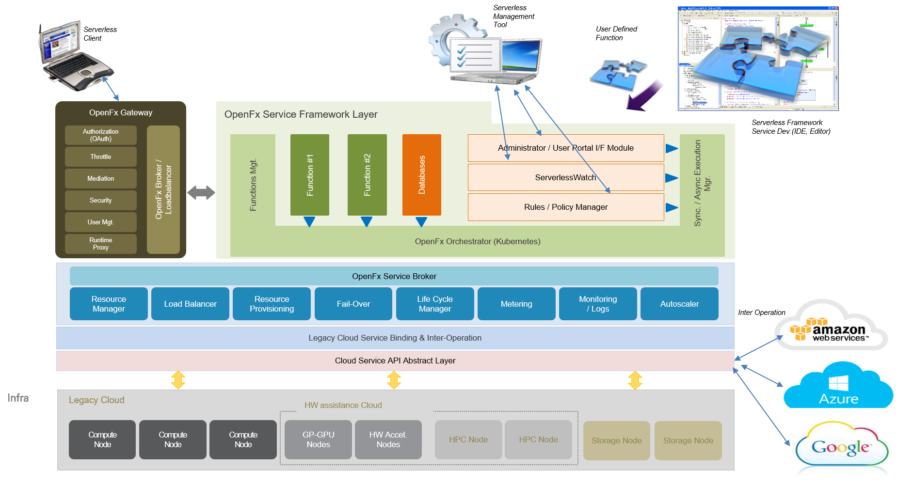
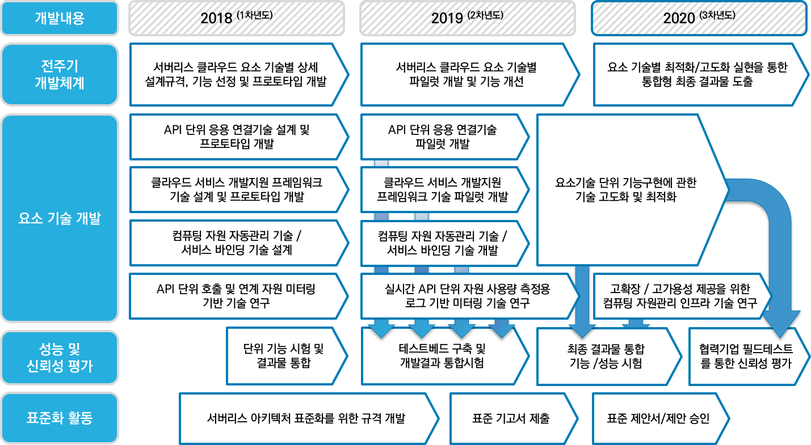

# OpenFx Roadmap

#### GitHub 프로젝트 / 소스 코드

OpenFx는 서버리스 오픈소스 프로젝트입니다. 프로젝트와 관련된 소스코드 및 세부 사항은 [OpenFx 깃 페이지](https://github.com/keti-openfx/openfx)에서 확인하세요.

#### 목표 클라우드 플랫폼 구성도

OpenFx의 목표는 `다양한 기능의 Plug & Play를 지원하고, 빠른 응답성 등 서버리스 클라우드 플랫폼 요구사항 반영` 입니다. 우리가 목표로하는 클라우드 플랫폼 구성도는 다음과 같습니다.

#### 연차별 기술개발 로드맵

OpenFx는 다음의 연차별 개발 계획을 가지고 목표 클라우드를 구성한다. 

 