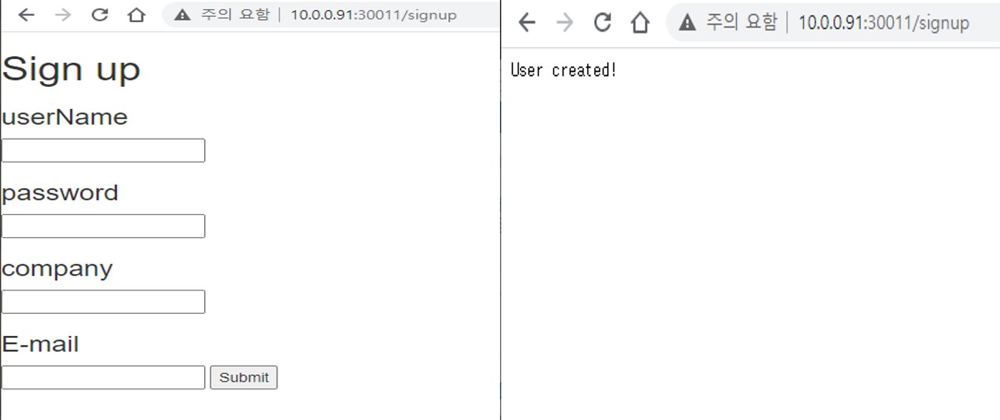

Auth Reference
==============

이 문서에서는 OpenFx의 적용된 접근 제어 기술에 관한 레퍼런스를 기술한다.

클라이언트 신청
^^^^^^^^^^^^^^^

OpenFx는 멀티 네임스페이스 환경을 지원하여 사용자 혹은 팀별 독립적인
함수 환경을 제공한다. 클라이언트 단위로 허용 네임스페이스가 정해지며
이를 위해 클라이언트 정보가 필요하다. 현재 OAuth2 클라이언트 정보같은
경우, OpenFx 관리자에게 별도의 메일로 신청하여
발급받는다.

접근 토큰 허용 시간
^^^^^^^^^^^^^^^^^^^

접근 토큰의 허용 시간은 7200초로 제한된다. 허용 시간이 지나면 토큰 발급
요청을 다시 해야한다. OAuth2 표준 문서에 따르면 refresh token 을 통해
허용 시간이 지나도 다시 발급받도록 허용할 수 있지만, 이는 OAuth2 제공
방식은 ``Authorization Code``\ 에 대해서만 국한된 얘기이다. OAuth2의
``client_credentials``, ``implict``\ 등의 제공 방식은 접근 코드의 보안
문제로 표준에서 refresh token 사용을 추천하지 않는다.

Curl을 통한 접근 토큰 발급
^^^^^^^^^^^^^^^^^^^^^^^^^^

Curl을 이용하여 HTTP 프로토콜로 OpenFx 의 접근을 위한 접근 토큰을
발급받을 수 있다. 토큰 발급을 위해서는 클라이언트 정보와 사용자 정보가
필요하다. 다음은 curl을 통해 접근 토큰을 발급받는 예이다.

::

    $ curl -H "username: user" -H "password: user" 
     -d grant_type=client_credentials -d client_id=alqzkxu4Bw.keti-openfx -d client_secret=XXOpbUbIMI http://keti.asuscomm.com:30011/token
     >> 
     {"access_token":"FHO3HX-XNA6GRBXLDWZJIW","expires_in":7200,"scope":"user-fn1","token_type":"Bearer"}

클라이언트 정보는 Body 값에 데이터를 저장하며, 사용자정보는 Header 값에
저장하여 전송한다. 이는 http에서 제공하는 표준안의 차선책(개인 정보는
Header에 전송하는 것을 권하나 상황에 따라 Body에 넣어 요청)을
선택하였는데,  gRPC에서 제공하는 http transcoding의 기능 중
header로의 변환 기능을 제공하지 않아 Body로의 변환 기능을 이용하여
전송하도록 설계하였다.

OpenFx-CLI을 통한 접근 토큰 발급
^^^^^^^^^^^^^^^^^^^^^^^^^^^^^^^^

접근 토큰 발급은 OpenFx-CLI을 통해서도 발급이 가능하다. 접근 토큰 발급을
위한 클라이언트 정보는 OpenFx-cli에 데이터를 저장한다. 저장 경로는
``~/.openfx/config.yml`` 이다.

::

    auths:
    - client_id: alqzkxu4Bw.keti-openfx
      client_secret: XXOpbUbIMI
      token: 
    '-': /root/.openfx/config.yml

OpenFx-CLI 같은 경우 OAuth2 Grant type 중 ``client credentials`` 을
선택하여 개발하였다. 이는 CLI은 client interactive환경이 아니며,
일시적인 웹 서버를 실행하여 구현할 수 있지만, CLI와 클라이언트 정보에
대한 1대1 매치가 필요하여 확장성이 떨어지게 된다. 그래서 본
기술문서에서는 redirect-url 정보를 입력하지 않으며 Client ID / Secret
정보만을 이용하여 클라이언트 등록을 할 수 있는 OAuth2
``client credentials`` 의 접근 방식을 선택하였다. 또한 사용자 권한별
접근 제어를 위해 client credentials 방식에 사용자 로그인 방식을
추가하였다.

OpenFx-CLI에 클라이언트 정보를 입력하였으면 ``Auth`` 명령어를 통해
사용자 로그인을 진행하고 접근 토큰을 발급받을 수 있다. 사용자 등록을
위한 회원가입은 ``http://keti.asuscomm.com:30011/signup``\ 에서 진행할
수 있다.

   signup
회원 가입으로 사용자 정보를 등록이 완료되었으면 OpenFx-CLI ``Auth``
명령어를 통해 접근 토큰을 발급받아 Openfx-cli 에 저장시킬 수 있다.
다음은 임의의 유저 user로 접근 토큰을 발급받아 접근 토큰을 확인하는
예제이다.

::

    $ openfx-cli fn auth --id user --pwd test
    >>
    You have successfully completed the certification.

::

    $ vi ~/.openfx/config.yml 
    >>
    auths:
    - client_id: alqzkxu4Bw.keti-openfx
      client_secret: XXOpbUbIMI
      token: 8G7E5IPGOBCKXTAMMTO2QW
    '-': /root/.openfx/config.yml

OpenFx-CLI ``auth``
^^^^^^^^^^^^^^^^^^^

OpenFx-CLI ``auth`` 명령어는 OpenFx의 OAuth2 모듈로부터 접근 토큰을 받아
Openfx-cli 에 저장하는 명령어이다. 사용하는 형식은 다음과 같다.

::

    $ openfx-cli fn auth --id user --pwd test
    >>
    You have successfully completed the certification.

-  ``--id`` : 사용자 아이디 입력
-  ``--pwd``: 사용자 비밀번호 입력

또한, ``auth`` 명령어를 통해 클라이언트 정보 및 Redirect URL 도 입력이
가능하다.

::

    $ openfx-cli fn auth --id user --pwd test --client-id <client-id> --client-secret <client-secret> --auth-url <url>
    >>
    You have successfully completed the certification.

-  ``--id`` : 사용자 아이디 입력
-  ``--pwd``: 사용자 비밀번호 입력
-  ``--client-id``: 클라이언트 아이디 입력
-  ``--client-secret``: 클라이언트 시크릿 입력
-  ``--auth-url``: Redirect URL 입력

OpenFX-CLI ``authinfo``
^^^^^^^^^^^^^^^^^^^^^^^

OpenFx-CLI ``authinfo`` 명령어는 OpenFx의 OAuth2 모듈로부터 발급받은
접근 토큰에 대해 정보를 확인할 수 있다. 다음은 그 예이다.

::

    $ openfx-cli fn authinfo
    Cleint ID             :  alqzkxu4Bw.keti-openfx
    User ID               :  admin
    Allowed resources     :  user-fn1
    Token valid time(sec) :  6084
    Grade                 :  admin

접근 토큰은 OpenFx-CLI 의 ``~/openfx/config.yml`` 에 저장된 접근 토큰을
전송하여 정보 값을 반환받는다.

HTTP 을 통한 OpenFx API 호출 레퍼런스
^^^^^^^^^^^^^^^^^^^^^^^^^^^^^^^^^^^^^

+---------------------------+---------------------------------------------+---------------------------------------------------------------+
| **OpenFx API** **항목**   | **기존** **OpenFx API** **호출**            | **OAuth2** **접근 모듈에 따른** **OpenFx API** **호출**       |
+===========================+=============================================+===============================================================+
| list                      | get /system/functions                       | post /api/listbody : {“token” : 접근 토큰}                    |
+---------------------------+---------------------------------------------+---------------------------------------------------------------+
| Invoke                    | get, post /system/function/{functionName}   | post /api/invoke/{functionName}body : {“token” : 접근 토큰}   |
+---------------------------+---------------------------------------------+---------------------------------------------------------------+
| deploy                    | post /system/functions                      | post /api/deploy body : {“token” : 접근 토큰}                 |
+---------------------------+---------------------------------------------+---------------------------------------------------------------+
| delete                    | delete /system/function/{functionName}      | post /api/delte/{functionName}body : {“token” : 접근 토큰}    |
+---------------------------+---------------------------------------------+---------------------------------------------------------------+

호출 예 :

::

    $ curl -d '{"token":"8G7E5IPGOBCKXTAMMTO2QW"}'  -X POST http://10.0.0.91:31113/api/list
    >>
    {"Functions":[{"Name":"echo-admin","Image":"10.0.0.91:5000/echo-admin","InvocationCount":"0","Replicas":"1","AvailableReplicas":"1","Annotations":{},"Labels":{"openfx_fn":"echo-admin","uid":"448324429","user":"user"}},{"Name":"echo-dev","Image":"10.0.0.91:5000/echo-dev","InvocationCount":"1","Replicas":"1","AvailableReplicas":"1","Annotations":{},"Labels":{"dev":"dev","openfx_fn":"echo-dev","user":"test"}}]}

