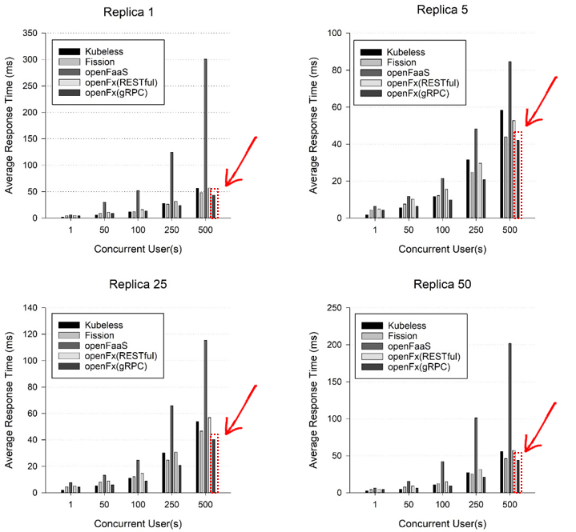

Benchmark
====================================

OpenFx는 gRPC 프로토콜을 지원하고, Golang 기반의 동시성을 중심으로 설계되어 동시성 호출에서 타 서버리스 프레임워크와 비교했을 때 빠른 응답성을 보장한다. 다음은 타 서버리스프레임워크와 동시접속 성능을 비교했을 때의  노드 환경과 시험 결과이다. 


<center>노드 스펙</center>

```
System Spec. Master Node
  - CPU: Intel® Xeon-Silver 4110 (2.1GHz, 11M, 8-cores, 16-threads) *2
  - Memory: Samsung 8GB PC4-19200R Registered ECC  * 8
  - Storage: 1TB & 2TB HDD
  - Network: Dual LAN with GbE from C621
  - OS: CentOS 7.0
  - Kubernetes Master, ETCD, Registry Server

System Spec. Node
  - CPU: Intel® Xeon-Silver 4110 (2.1GHz, 11M, 8-cores, 16-threads) *2
  - Memory: Samsung 8GB PC4-19200R Registered ECC   *8
  - Storage: 1TB & 2TB HDD
 - Network: Dual LAN with GbE from C621
  - OS: CentOS 7.0
  - Kubernetes Node (Pods), API Gateway…
```


<center> 동시접속 성능 시험 결과</center>



X축 좌표는 동시접속 수이다. Y축 좌표인 Average Response Time(ms) 은 평균 응답 시간으로 적을 수록 빠른 응답성 보여주는 지표이다.  실험 결과에 따르면 OpenFx의 평균 응답시간은 동시접속이 100이상부터 타 서버리스 플랫폼과 비교 성능적으로 큰 차이로 적어지는 것을 알 수 있었다. 
