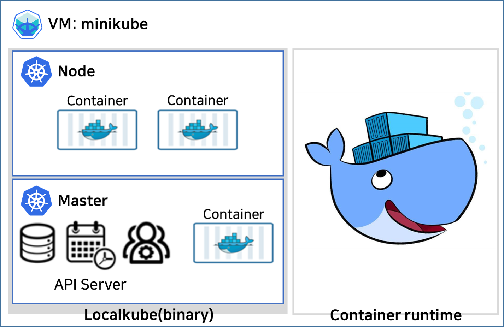

# 2. Installing Minikube

 미니쿠베(Minikube)는 쿠버네티스(Kubernetes)처럼 클러스터를 구성하지 않고 단일 컴퓨팅환경(노트북, 데스크탑 등)에서 쿠버네티스 환경을 만들어준다.  로컬 환경에서 단일 클러스터를 구동시킬 수 있는 도구인 미니쿠베는 단일 노드에 쿠버네티스 클러스터 환경을 구축하기 때문에 접근성이 뛰어나고 클러스터를 관리하기가 수월하며, 이로 인해 더욱 용이해진 디버깅 환경을 사용자에게 제공하여 편의성을 높여준다. 



 이번 1장에서는 그림과 같은 미니쿠베 환경 구성을 위해 VM, Minikube, 그리고 쿠버네티스 명령 줄 인터페이스인 kubectl을 설치한다.


# Installing VM

 미니쿠베를 시작하기 전, 미니쿠베를 통해 쿠버네티스 컴포넌트를 VM 위에서 동작시키기 위해 다음의 링크를 통해 [버츄얼박스](https://www.virtualbox.org/)를 설치한다.  VM이 아닌 호스트 OS 환경(Mac, 리눅스 등)이라면, VM 설치를 생략한다.


# Configuration

미니쿠베를 통해 구동된 쿠버네티스 클러스터 위에서 OpenFx 코어를 동작시키기 위해서는 기본적으로 다음과 같은 최소 사양이 만족되어야 한다.  

- `프로세서 코어` 2개 이상
- `메모리` 8GB 이상
- `하드디스크` 100GB 이상
- `네트워크` 지원 가능


# Installing Minikube

 VM 설치가 완료되면, 본격적으로 쿠버네티스 클러스터를 로컬 환경에서 구축하기 위한 미니쿠베 설치를 진행하여야 한다. 본 가이드에선 호스트 OS (Mac Os, Ubuntu18.04)를 기준으로 테스트하여 작성하였다.

## Mac OS

    $ brew cask install minikube


## Ubuntu

    $ wget minikube https://storage.googleapis.com/minikube/releases/latest/minikube-linux-amd64 \
      && chmod +x minikube-linux-amd64
    $ sudo mv minikube-linux-amd64 minikube
    $ sudo mv minikube /usr/local/bin 


# Start Minikube

- 미니쿠베를 시작하기 전, 미니쿠베는 기본적으로 다음의 VM 드라이버를 지원한다. 

    - virtualbox
    - vmwarefusion
    - kvm2
    - hyperkit
    - hyperv
    - vmware

    > VM 드라이버 설치를 원하는 사용자는 다음의 [링크](<https://minikube.sigs.k8s.io/docs/reference/drivers/>)를 통해 설치할 수 있다. 

- VM이 아닌 호스트 OS(Mac OS, 리눅스 등)에서 미니쿠베를 구동하는 사용자들은 `--vm-driver` 옵션을 `none`으로 설정한다. 또한, 현재 가장 최신 버전의 미니쿠베는 기본 값으로 쿠버네티스 버전 `1.16.0`이 설치된다. 하지만 OpenFx 코어는 쿠버네티스 버전 `1.15.2` 까지 지원하기 때문에 미니쿠베 시작 시 쿠버네티스 버전을 지정해주어서 아래와 같은 명령어로 미니쿠베를 시작한다.

    ```
    $ echo export CHANGE_MINIKUBE_NONE_USER=true >> ~/.bashrc
    $ sudo minikube start --vm-driver=none --kubernetes-version v1.15.2 --insecure-registry="<IP ADDRESS>:<PORT>"
    ```

    > `<IP ADDRESS>:<PORT>` : 앞으로 생성할 도커 레지스트리 서버의 주소와 포트번호를 적어준다. 본 가이드에서는 호스트 OS 혹은 VM의 IP와 포트번호,  5000으로 작성하였다.


- VM에서 미니쿠베를 구동하는 경우,  `--vm-driver` 옵션을 `설치한 VM 이름 ` 으로 설정하여야 한다.  본 가이드에서는 VM 드라이버로 버츄얼박스를 사용하여 미니쿠베를 구동시키고자 하기 때문에 아래와 같은 명령어로 미니쿠베를 시작한다.**(향후 업데이트 예정)**

        $ echo export CHANGE_MINIKUBE_NONE_USER=true >> ~/.bashrc
        $ sudo minikube start --vm-driver=virtualbox --kubernetes-version v1.15.2 --insecure-registry="<IP ADDRESS>:<PORT>"

- `~/.kube`,  `~/.minikube` 폴더의 권한을 `$USER`로 변경한다.

  ```
  $ sudo chown -R $USER ~/.kube ~/.minikube
  ```

- Minikube에서 Horizontal Pod Autoscaling이 가능하게 하려면 다음과 같은 명령어로 설정을 변경해주어야 한다. 

  ```
  $ minikube addons disable heapster
  $ minikube addons enable metrics-server
  ```


# Installing kubectl

 `kubectl`은 쿠버네티스를 제어하기 위한 명령 줄 인터페이스이다. 아래와 같은 명령어로 kubectl을 설치한다.

## MacOS

    $ brew install kubernetes-cli
    $ kubectl version
    >>
    Client Version: version.Info{Major:"1", Minor:"12", GitVersion:"v1.12.2", GitCommit:"17c77c7898218073f14c8d573582e8d2313dc740", GitTreeState:"clean", BuildDate:"2018-10-24T06:54:59Z", GoVersion:"go1.10.4", Compiler:"gc", Platform:"linux/amd64"}
    Server Version: version.Info{Major:"1", Minor:"15", GitVersion:"v1.15.2", GitCommit:"f6278300bebbb750328ac16ee6dd3aa7d3549568", GitTreeState:"clean", BuildDate:"2019-08-05T09:15:22Z", GoVersion:"go1.12.5", Compiler:"gc", Platform:"linux/amd64"}

- `kubectl version`을 통해 출력되는 정보는 상이할 수 있다. 


## Ubuntu

    $ curl -LO https://storage.googleapis.com/kubernetes-release/release/$(curl -s https://storage.googleapis.com/kubernetes-release/release/stable.txt)/bin/linux/amd64/kubectl
    $ curl -LO https://storage.googleapis.com/kubernetes-release/release/v1.14.0/bin/linux/amd64/kubectl
    $ chmod +x ./kubectl
    $ sudo mv ./kubectl /usr/local/bin/kubectl
    $ kubectl version
    >>
    Client Version: version.Info{Major:"1", Minor:"12", GitVersion:"v1.12.2", GitCommit:"17c77c7898218073f14c8d573582e8d2313dc740", GitTreeState:"clean", BuildDate:"2018-10-24T06:54:59Z", GoVersion:"go1.10.4", Compiler:"gc", Platform:"linux/amd64"}
    Server Version: version.Info{Major:"1", Minor:"15", GitVersion:"v1.15.2", GitCommit:"f6278300bebbb750328ac16ee6dd3aa7d3549568", GitTreeState:"clean", BuildDate:"2019-08-05T09:15:22Z", GoVersion:"go1.12.5", Compiler:"gc", Platform:"linux/amd64"}

- `kubectl version`을 통해 출력되는 정보는 상이할 수 있다. 


# Verify installed minikube

 VM, 미니쿠베, 그리고 kubectl 설치까지 모두 완료하면, 쿠버네티스 클러스터가 정상적으로 동작하는지를 확인하여야 한다. 이는 아래와 같은 명령어를 통해 확인할 수 있다. 

    $ kubectl get pods --all-namespaces
    >>
    NAMESPACE     NAME                               READY   STATUS             RESTARTS   AGE
    kube-system   coredns-fb8b8dccf-4bq7x            1/1     Running   0          113s
    kube-system   coredns-fb8b8dccf-jw6j2            1/1     Running   0          113s
    kube-system   etcd-minikube                      1/1     Running   0          4m19s
    kube-system   kube-addon-manager-minikube        1/1     Running   0          4m22s
    kube-system   kube-apiserver-minikube            1/1     Running   0          4m17s
    kube-system   kube-controller-manager-minikube   1/1     Running   0          4m6s
    kube-system   kube-proxy-h8q7p                   1/1     Running   0          5m11s
    kube-system   kube-scheduler-minikube            1/1     Running   0          4m16s
    kube-system   storage-provisioner                1/1     Running   0          5m7ss


# Trouble Shooting (CrashLoopBackOff Error)

 호스트 OS 혹은 VM에서 미니쿠베를 실행할 경우, 아래와 같이 에러가 발생할 수 있다.

    $ kubectl get pods --all-namespaces
    >>
    NAMESPACE     NAME                               READY   STATUS             RESTARTS   AGE
    kube-system   coredns-fb8b8dccf-mtn7d            0/1     CrashLoopBackOff   5          3m54s
    kube-system   coredns-fb8b8dccf-t584j            0/1     CrashLoopBackOff   5          3m54s
    kube-system   etcd-minikube                      1/1     Running            0          2m46s
    kube-system   kube-addon-manager-minikube        1/1     Running            0          4m1s
    kube-system   kube-apiserver-minikube            1/1     Running            0          2m51s
    kube-system   kube-controller-manager-minikube   1/1     Running            0          2m52s
    kube-system   kube-proxy-rtswf                   1/1     Running            0          3m54s
    kube-system   kube-scheduler-minikube            1/1     Running            0          2m51s
    kube-system   storage-provisioner                1/1     Running            0          3m53s

이는 다음과 같이 해결할 수 있다.

- **Solution #1**

  - **CoreDns configmap**을 수정한다. 이는 아래와 같은 명령어를 실행 후, `loop`라는 단어를 삭제한다.

    ```
    $ kubectl -n kube-system edit configmap coredns
    ```

  - `loop`라는 단어 삭제 후, **CoreDns configmap** 수정이 완료되면, 새로운 설정이 적용된 포드를 생성하기 위해 기존 포드를 삭제한다.

    ```
    kubectl -n kube-system delete pod -l k8s-app=kube-dns
    ```


- **Solution #2**

  - **Solution #1**의 방법으로 에러가 해결이 안되면 이는 방화벽 규칙의 문제일 수 있다. 쿠버네티스 클러스터 구동 시, 기본적으로 추가되는 방화벽 규칙들이 있다. 하지만 쿠버네티스 클러스터 구동 중, 방화벽 규칙이 제대로 추가되지 않거나 기존의 규칙들과 충돌이 일어날 수 있다. 이 같은 경우, 기존의 규칙들을 모두 제거하고, 쿠버네티스, 도커 관련 방화벽 규칙들을 재 정의 해주어야 하며, 이는 아래와 같은 명령어로 실행할 수 있다. 

    ```
    $ iptables -t nat -F
    $ iptables -t mangle -F
    $ iptables -F
    $ iptables -X
    $ iptables -P INPUT ACCEPT
    $ iptables -P FORWARD ACCEPT
    $ iptables -P OUTPUT ACCEPT
    $ iptables -N DOCKER
    $ iptables -N DOCKER-ISOLATION
    ```


### REFERENCE

1. [Minikube 설치](https://kubernetes.io/ko/docs/tasks/tools/install-minikube/)
2. [coredns pods have CrashLoopBackOff or Error state](https://stackoverflow.com/a/53414041/2153777)
