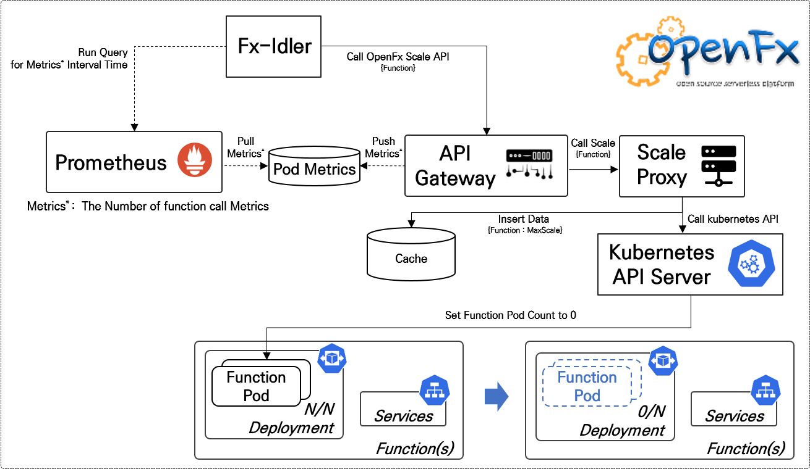
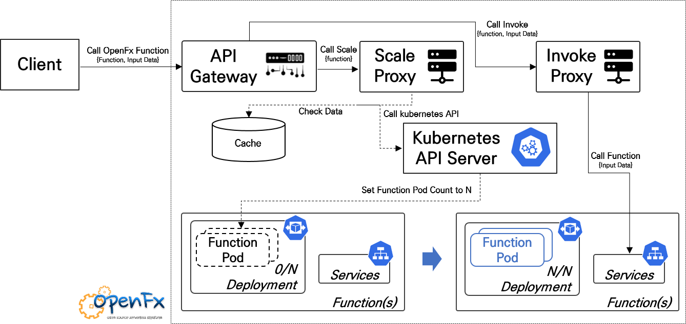

# Fx-Idler

Automatically Scale Module that OpenFx functions to zero replicas after a period of inactivity

> Premise:  To scale the general purpose to zero, we need a traffic metric for the functions. In this module, Traffic is observed from Prometheus metrics collected in the OpenFx API Gateway.




**Fx-idler is implemented as a controller**

* Polls Prometheus metrics on a regular basis 
* Identify functions that are not called for a certain amount of time

* Request scale zero API in OpenFx API Gateway about not called functions


### Requirments

> When you call functions whose scale is 0, you need logic that can expand to N/N. OpenFx uses a cache to scale the function in API Gateway.



The logic can be checked through the [following link](https://github.com/keti-openfx/openfx/blob/3f54111f472b8d3936008ef432a8a3ba6cd11c5c/server.go#L69).


## Building

The build requires Docker and builds a local Docker image.

```
$ vi Makefile 

REGISTRY=10.0.0.52:5000 # Input your Docker Private Registry 
TAG?=0.1.0 # Tag 

$ make build && make push 
```


## Usage

### Quick start

#### kubernetes:

```
kubectl apply -f fx-idler-dep.yml
```


### Configuration

- Environmental variables:

When distributing this module, you can change the setting value of the module through the environment variable value.

| env_var               | description                                                  |
| --------------------- | ------------------------------------------------------------ |
| `gateway_url`         | The URL for the API gateway i.e. [http://gateway:31113](http://gateway:31113/) for Kubernetes |
| `prometheus_host`     | host for Prometheus                                          |
| `prometheus_port`     | port for Prometheus                                          |
| `inactivity_duration` | i.e. `15m` (Golang duration)                                 |
| `reconcile_interval`  | i.e. `1m` (default value)                                    |
| `write_debug`         | default `false`, set to `true` to enable verbose logging for debugging / troubleshooting |

How it works:

`gateway_function_invocation_total` is measured for activity over `duration` i.e. `1h` of inactivity (or no HTTP requests)


## Logs

You can view the logs to show reconciliation in action.

```
kubectl logs deploy/fx-idler -n openfx
```
