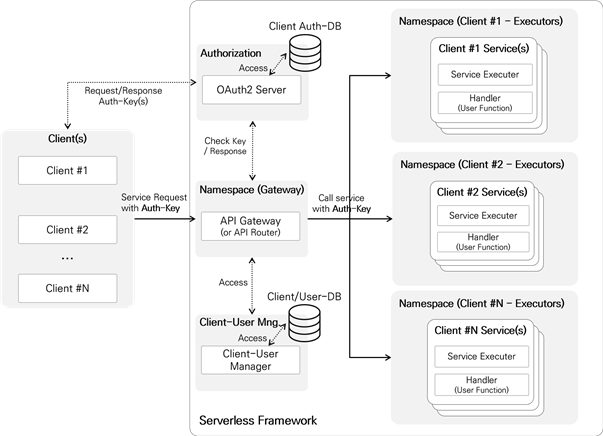

# OpenFx OAuth Server 2.0 

> OAuth2.0 server for access authorization of OpenFx. OAuth2.0 The OAuth2.0 server applied an [open source project based](https://github.com/go-oauth2/oauth2)





## Building

The build requires Docker and builds a local Docker image.

```
$ vi Makefile 

REGISTRY=10.0.0.52:5000 # Input your Docker Private Registry 
TAG?=0.1.0 # Tag 

$ make build && make push 
```


## Access Token issuance procedure

> For testing, We provided [openfx-cli-oauth](https://github.com/keti-openfx/OpenFx-CLI-Auth) that oauth2.0 applied command line tool. 

Access tokens are required for calls OpenFx functions. 


The following data is required to issue an Access token.

* OAuth2 client information: client ID, client secret 

* User information: User ID, User Password 

  > Membership registration for user registration can be done at`http://keti.asuscomm.com:30011/signup`

* OAuth2 client information: client ID, client secret 

  > For OAuth2 client information, OpenFx It is issued by requesting a separate e-mail from the administrator (<tmdgh7186@keti.re.kr>). 


The following is the example client information provided by example.

```
Client ID : alqzkxu4Bw.keti-openfx
client_secret: XXOpbUbIMI
```


The allowed name space value is set to `user-fn1` in the client.  The issued client information is stored in OpenFx-CLI. The storage path is It is `~/.openfx/config.yml`

```
auths:
- client_id: alqzkxu4Bw.keti-openfx
  client_secret: XXOpbUbIMI
  token: 
'-': /root/.openfx/config.yml
```

 

After entering the client information in the CLI, enter the member information through the following command to receive an access token. (example ID: test, PWD:test)

```
$ openfx-cli fn test --id user --pwd test
>>
2020/08/31 00:57:45 You have successfully completed the certification.
```


The access token is stored in openfx-cli.  If you check `~/.openfx/config.yml` You can check that the access token is stored. Also in openfx-cli You can check the access token information through authinfo.

```
$ openfx-cli fn authinfo
>>
Cleint ID             :  alqzkxu4Bw.keti-openfx
User ID               :  test
Allowed resources     :  user-fn1
Token valid time(sec) :  312
Grade                 :  user
```


### Usage 

When an access token is registered in CLI, you can use the openfx API without additional work.

```
$ echo "HELLO OAUTH2 OPENFX!" | openfx-cli fn call echo-dev
>>
HELLO OAUTH2 OPENFX! 
```


When calling a function for an unauthorized function, the following error message is displayed. Is output.

```
$ echo "HELLO OAUTH2 OPENFX!" | openfx-cli fn call echo-admin 
>> 
This is an unauthorized function call.
```


